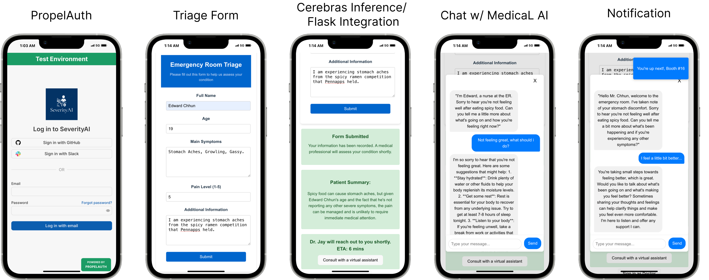
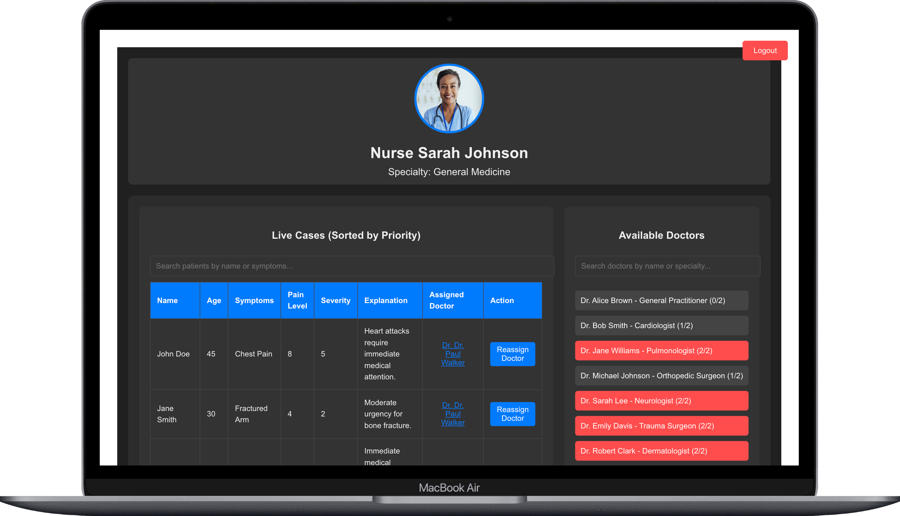
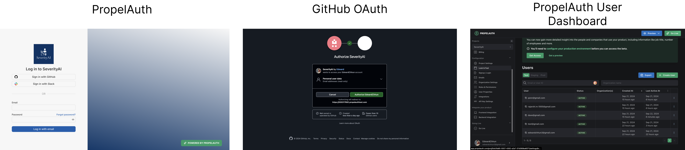

## Demo Video
Click on the image below to see the demo video!

[](https://www.youtube.com/watch?v=4-_6q-zsYQo target="_blank")
 
 ## Inspiration

The inspiration for SeverityAI came from a personal experience that one of our team members had last year. After experiencing heart palpitations, he had to visit the emergency room, only to be shocked by the overwhelming number of patients—some bloody, others coughing heavily. Seeing over a hundred people waiting in discomfort made him realize just how inadequate the current emergency room management system is in handling patient flow and prioritization.

This experience planted the seed for SeverityAI, as we wanted to create a solution that could prioritize patients based on urgency, reducing wait times and ensuring those who need immediate care get it faster. Additionally, we noticed that many patients, while waiting for a doctor, are anxious and uncertain about their condition. This insight led to the development of our chatbot feature, designed to engage with patients, provide them with reassurance, and answer questions while they wait.

By addressing these challenges, we hope to make a real-world impact on emergency room efficiency and patient experience.

## What it does

__Emergency Room Triage Workflow__  


__Management Dashboard Software for Nurses with Classified Severity__  


Our mobile app allows patients to quickly describe their symptoms, rate their pain, and provide basic personal information such as age and name. An AI-powered model then evaluates this input and assigns each patient a rating from 1 to 5, indicating the urgency of their care needs. Patients with critical conditions are prioritized, while those with less immediate concerns can safely wait longer without risk of complications.

While waiting, patients can interact with a personalized chatbot that answers common questions, provides reassurance, and offers relevant medical information. On the admin side, healthcare providers can view all patient submissions in real time, making it easier to manage patient flow. An AI-driven algorithm matches patients to available doctors based on urgency, ensuring timely care and improving overall efficiency in emergency rooms.

## How we built it

Our project was developed using a combination of modern tools and technologies. We used _VSCode_ as our primary integrated development environment (IDE) to write and organize the code, and _GitHub_ for version control and team collaboration.

The backend is powered by _Python_ running on a _Flask_ server, handling the data processing and interactions with the AI model. For patient urgency classification, we integrated the _Cerebras API_, which provided the LLM that evaluates each patient’s symptoms and assigns an urgency score. 

__API Call to Cerebras Inference with Llamma Prompt Engineering__
```javascript
const response = await axios.post(import.meta.env.VITE_FLASK_END_POINT + '/chat', { 
        message: input,
        summary: patientSummary // Include the summary in each message for context
      });
```

What the flask server returns to the chat box
```python
@app.route('/chat', methods=['POST'])
def chatbot():
    user_message = request.json['message']
    patient_summary = request.json.get('summary', '')  # Get the summary if provided
    
    # Create a system message that includes the patient summary
    system_message = f"""You are an AI assistant in an emergency room triage system. 
    You have the following information about a patient:

    {patient_summary}

    Provide empathetic and helpful responses to the patient's questions or concerns. 
    Do not provide medical advice or diagnosis. If the patient's condition seems to 
    worsen or they report new severe symptoms, advise them to immediately notify the medical staff. 
    Do not use bold letters in your responses."""

    # Create a chat completion using Cerebras
    response = client.chat.completions.create(
        messages=[
            {"role": "system", "content": system_message},
            {"role": "user", "content": user_message}
        ],
        model="llama3.1-8b",
        max_tokens=150
    )
    
    bot_response = response.choices[0].message.content
    return jsonify({'response': bot_response})
```

On the frontend, we used _React.js_, _HTML5_, and _CSS_ to create a user-friendly interface for both patients and healthcare providers. The database is built using _JSON_, which stores information about both patients and available doctors, enabling real-time updates. _Propel Authentication_ was implemented to securely manage admin logins, ensuring that only authorized personnel can access patient submissions.

__PropelAuth / GitHub OAuth__


This combination of technologies allowed us to create a robust and scalable solution to improve emergency room efficiency.

## Challenges we ran into

We faced several challenges during the development of SeverityAI. One of the biggest technical hurdles was with our MongoDB database. The university had closed the port needed for MongoDB connections, so we tried using a personal hotspot as a workaround. However, due to being in a limited cellular area, the hotspot wasn’t reliable. In the end, we had to pivot to using simple JSON files as a temporary solution to keep our project on track, with plans to integrate a more robust solution later.

On top of the technical issues, we also had to navigate some logistical challenges. One of our team members could only join on Saturday morning due to a conference the day before, and we each had specific workshops we wanted to attend, as well as varying sleep requirements. Despite these obstacles, we persevered, collaborated effectively, and were proud to submit a high-quality project on time.

## Accomplishments that we're proud of

Our team is incredibly proud of the tangible real-world impact our project could have in revolutionizing emergency room efficiency. We successfully developed an AI-driven system that can prioritize patient care based on urgency, reducing wait times and ensuring that those in critical condition are seen by doctors faster.

We also take pride in the smooth integration of diverse technologies—our use of the Cerebras API for the AI model, the seamless frontend interface built with React.js, and the real-time database powered by JSON. Each piece came together to form a cohesive solution that we believe could truly benefit healthcare systems.

Additionally, we are proud of the teamwork and collaboration we exhibited throughout the process. Despite coming from different locations and backgrounds, our ability to work together—spanning across a wide range of ages and skills—was a key factor in our success. The dedication, including the countless sleepless nights, paid off, and we’re excited about the potential of what we built.

## What we learned

Throughout the development of SeverityAI, we gained valuable experience and improved our skills in both front-end and back-end development. Building a full-stack app from scratch and deploying it was a great learning experience for all of us. We also explored various sponsor APIs, particularly the Cerebras API, which allowed us to integrate advanced AI capabilities into our app.

The workshops at PennApps were instrumental in expanding our knowledge. A special shoutout to **Patient Safety 101**, **Building ChatGPT but 16x Faster with Cerebras API**, **Intro to Bloomberg**, **Roboflow Workshop**, **Build with Palantir!**, and the **Poker** workshops/minievents, which provided us with fresh perspectives and practical skills. These workshops not only enriched our project but also contributed to our personal growth as developers.

Finally, we’d like to express our gratitude to **PennApps** for giving us this incredible opportunity to learn, collaborate, and push our limits. The experience has been invaluable, and we are excited to carry these lessons forward in future projects.

## What's next for SeverityAI

We see tremendous potential in SeverityAI to transform emergency room workflows, and we’re excited to take this project to the next level. Our team is considering turning this idea into a full-fledged startup and pitching it to potential investors. The goal is to develop the app further, refining the AI model to increase accuracy and scalability while ensuring it integrates seamlessly with hospital systems.

We also aim to expand the chatbot’s capabilities, allowing it to provide even more personalized assistance to patients during their wait time. In addition, we plan to explore partnerships with healthcare providers to pilot the app in real-world environments and gather critical feedback to improve functionality.
